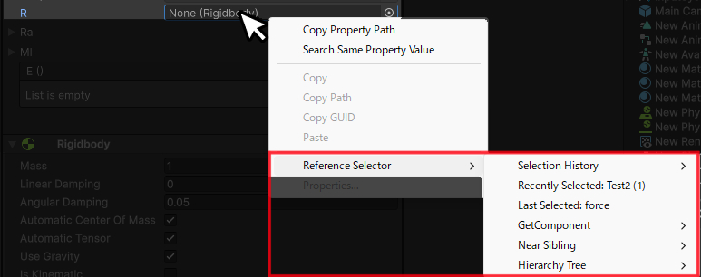

## Custom Context Menu
---
You can open the Reference Selector menu by right-clicking on a reference field.

## Selection History 
---
Only objects that are compatible with the target field type will be available for assignment.

## Recently Selected
---
You can assign a recently selected object that is compatible with the target field type.

## Find in Hierarchy Tree
---
This feature lets you search for and assign objects of the same type as the reference field from parent, child, or sibling objects.

