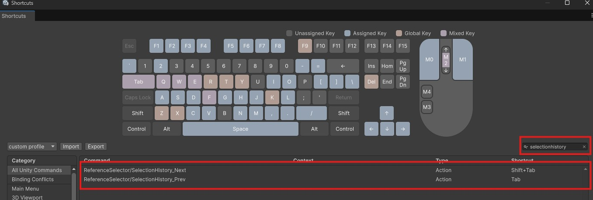

## Selection History
---
This asset stores the history of selected scene objects and asset objects. 
The stored history can be accessed from the `Open History` menu displayed at the top of the Inspector. 
This selection history is also used when assigning references via the **Reference Selector** context menu. 
Additionally, you can directly open the Inspector window for a selected object by **Ctrl+clicking** it.

- `PREV`: Selects the previous item in the selection history.
- `NEXT`: Selects the next item in the selection history.
- `Open History`: Displays the selection history list and allows you to select any item.

> [!TIP]
> The selection history is preserved even after script recompilation. 
> History entries for scene objects are not lost when a scene is unloaded, and become valid again when the scene is reopened.

## Options
---
- `Reset History`: Resets the selection history.
- `Hide Unselectable Items`: Hides items that cannot be selected in the context menu.
- `Hide SelectionHistory GUI`: Hides the **Selection History GUI** displayed at the top of the Inspector. It can be shown again from **Tools / Reference Selector**.
- `Edit Shortcuts...`: Opens the shortcut settings window.
- `Edit Preferences...`: Opens the **Reference Selector** preferences.
- `Reference Selector Ver: X.X.X`: Displays the **Reference Selector** version.

## Shortcut Keys
---
By default, the following shortcuts are assigned:

- `Shift + Mouse Wheel Down`: PREV button
- `Shift + Mouse Wheel Up`: NEXT button

> [!TIP]
> You can open the shortcut settings window at any time from **Edit / Shortcuts** or **Edit Shortcuts...**.

