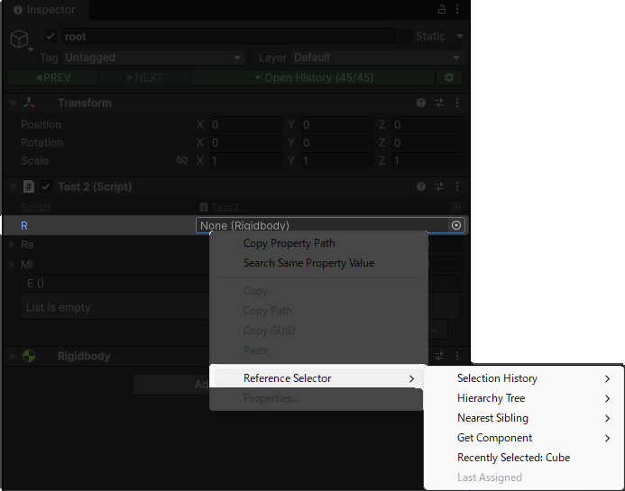
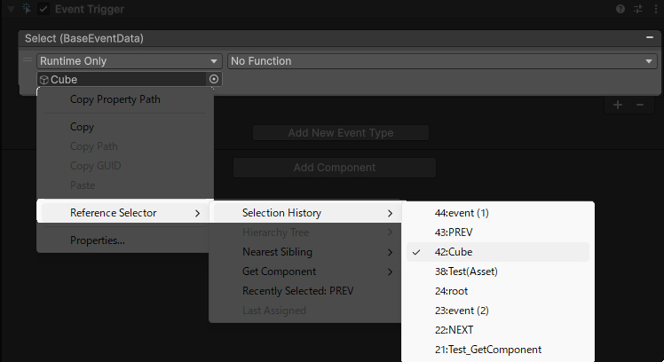
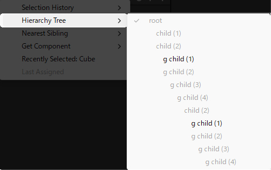
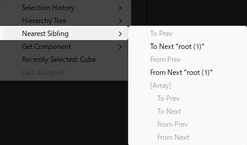
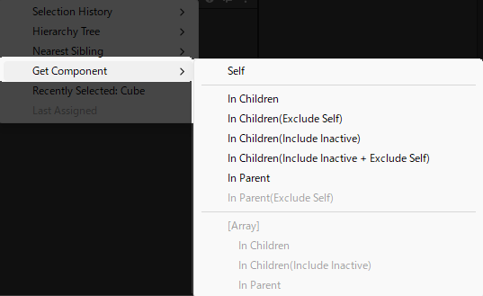

## カスタムコンテキストメニュー
---
参照フィールド上で右クリックすることで、Reference Selector のカスタムメニューを呼び出すことができます。 
通常の参照フィールドだけでなく、配列・リストフィールドにも対応しています。

## Selection History 
---
選択履歴の中から、任意のオブジェクトを参照として設定できます。 
参照フィールドに割り当て可能な型を持つオブジェクトのみが表示されます。

## Hierarchy Tree
---
親・子・同一階層のオブジェクトを対象に、参照フィールドと同一の型を持つオブジェクトを検索して割り当てます。 
複数オブジェクトを選択している場合は、それぞれのオブジェクトごとに個別処理が行われます。 
アクティブオブジェクト以外についても、それぞれの階層位置を基準に検索が行われます。 
対応するオブジェクトが見つからない場合は、null が設定されます。

## Nearest Siblings
---
同一階層上の前後の兄弟オブジェクトを対象に、参照フィールドと同一の型が見つかるまで検索を行います。 
見つかった最も近いオブジェクト同士の間で、参照のコピー（双方向）が可能です。 
配列フィールドにも対応しており、複数選択時には各オブジェクトごとに個別処理が行われます。

## Get Component
---
GetComponent系APIと同等の処理を、エディタ上で直接実行できます。 
配列フィールドにも対応しており、複数選択時には各オブジェクトごとに個別処理が行われます。

## Recently Selected
---
Selection History の中から、最も直近で割り当て可能な参照オブジェクトを自動的に設定します。

## Last Assigned
---
Reference Selector のメニュー操作によって、最後に割り当てられた参照オブジェクトを再設定します。

