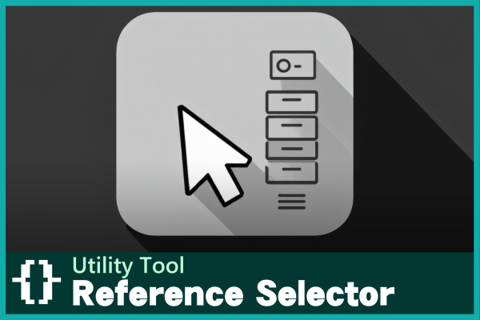
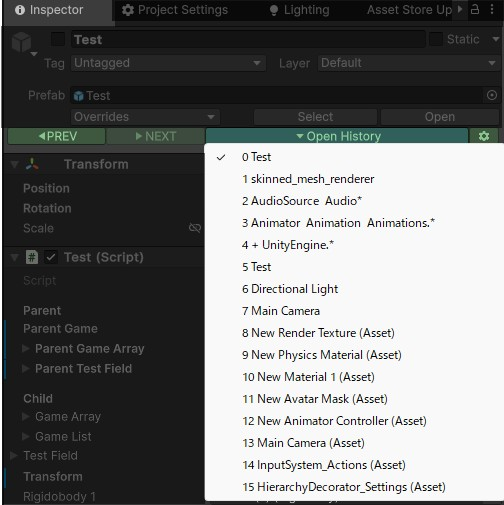

# はじめに
---

このアセットはUnityEditor上で参照フィールドに設定するためのドラッグアンドドロップアクションを軽減する目的で作られました。 
主な機能は以下の2つです。  

## 1. 参照フィールド設定機能
---
ほぼ全ての参照フィールド上でコンテキストメニューを開き、選択ヒストリーから素早く参照オブジェクトを設定できます。 
コンテキストメニューの項目は以下の通りです。

- `SelectionHistory`: 選択履歴内から任意のオブジェクトを設定
- `Hierarchy Tree`: 親子関係のあるオブジェクトから設定
- `Nearest Sibling`: 同階層の前後のオブジェクトから設定
- `Get Component`: GetComponent系のメソッドを実行し設定
- `Recently Selected`: 対象の型を持つ、最近選択したオブジェクトを設定
- `Last Assigned`: このアセットにより最後に設定したオブジェクトを設定

## 2. 選択ヒストリー機能
---
選択したオブジェクトの履歴を保持し、インスペクタ上部にアクセスボタンが配置されます。 
ドロップダウンリストやショートカットキーを使って、履歴内のオブジェクトに素早くアクセスできます。 
また、Ctrl+クリックで、選択したオブジェクトのインスペクタウィンドウを開くことができます。

- `シフト+ホイールダウン`: 選択ヒストリーから1つ前のオブジェクトを選択
- `シフト+ホイールアップ`: 選択ヒストリーから1つ後のオブジェクトを選択

（ショートカットキーはEdit/Shortcuts画面から変更可能です。）

## 3. サポート

- フルUndo対応。
- ドメインリロード対応 (再コンパイルしても状態が壊れることがありません)
- 対応Unityバージョン：Unity 6 以降
- Odin Inspectorとの併用が可能。
- バグ報告はこちらまでお願いします： 
　motose6★gmail.com 
　<https://github.com/emptybraces/Unity-ReferenceSelector-OnlineManual/issues>
