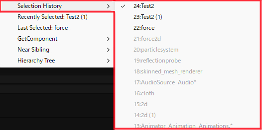

## カスタムコンテキストメニュー
---
参照フィールド上で右クリックすることで、Reference Selectorのメニュ－を呼び出すことができます。

## Selection History 
---
選択履歴内から任意のオブジェクトを設定できます。フィールドに設定することができる型を持つ項目のみがアクティブになります。

## Recently Selected
---
最近選択したオブジェクトのうち、フィールドに設定可能な型を持つものを設定できます。

## Selection History 
---
選択履歴内から任意のオブジェクトを設定します。

## Selection History 
---
選択履歴内から任意のオブジェクトを設定します。

## Selection History 
---
選択履歴内から任意のオブジェクトを設定します。

## Find in Hierarchy Tree
---
親、子、同一階層のオブジェクト群から、参照フィールドと同一の型を探しアサインすることができます。

