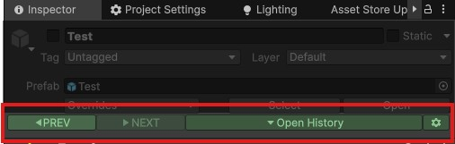
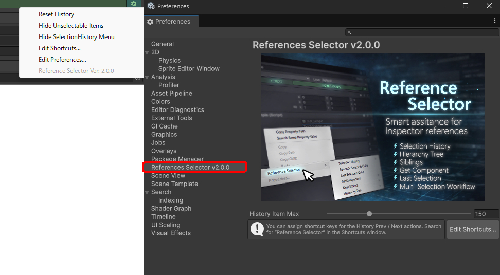

## 選択履歴
---
このアセットは、選択したシーン内オブジェクトおよびアセットオブジェクトの履歴を保存します。 
保存された履歴は、インスペクタ上部に表示される `Open History` メニューから操作できます。 
また、 **Reference Selector** のコンテキストメニューによる参照割り当て時にも、この選択履歴が利用されます。 
さらに、Ctrl+クリックすることで、選択したオブジェクトのインスペクタウィンドウを直接開くことができます。

- `PREV`: 選択履歴から、ひとつ前の項目を選択します。
- `NEXT` : 選択履歴から、ひとつ次の項目を選択します。
- `Open History`: 選択履歴の一覧を表示し、任意の項目を選択できます。

> [!TIP]
> 再コンパイル後も選択履歴は保持されます。 
> シーン内オブジェクトの履歴も、シーンをアンロードして失われることはなく、再度シーンを開いた際に有効になります。

## オプション 
---
- `Reset History` : 選択履歴をリセットします。
- `Hide Unselectable Items` : コンテキストメニューで選択できない項目を非表示にします。
- `Hide SelectionHistory GUI` : インスペクタ上部の **Selection History GUI** を非表示にします。**Tools/Reference Selector** から再表示できます。
- `Edit Shortcuts...` : ショートカット設定ウィンドウを開きます。
- `Edit Preferences...` : **Reference Selector** のプリファレンスを開きます。
- `Reference Selector Ver: X.X.X` : **Reference Selector** のバージョンを表示します。

## ショートカットキー
---

デフォルトでは、以下のショートカットが設定されています。

- `シフト+ホイールダウン` : PREV ボタン
- `シフト+ホイールアップ` : NEXT ボタン

> [!TIP]
> **Edit/Shortcuts** または **Edit Shortcuts...** から、ショートカット設定ウィンドウを開いていつでも変更できます。

